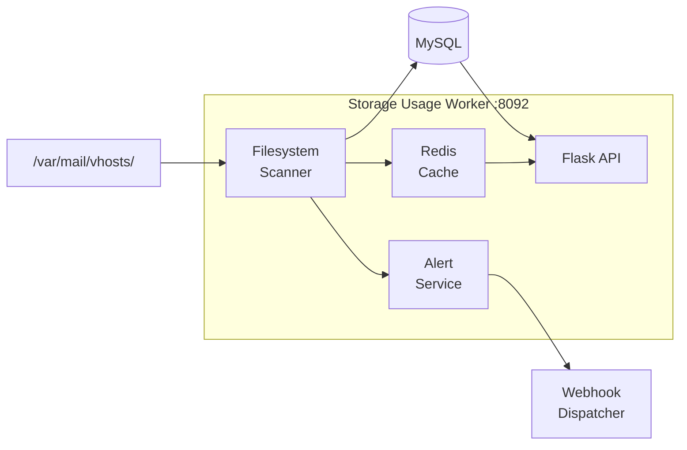

# Storage Usage Worker

> **Enterprise Edition** — This feature is available in [Mailyte Enterprise](https://mailyte.com). The Community Edition does not include this functionality.


The storage usage worker tracks real disk usage per mailbox, enforces storage quotas, and sends alerts when users approach their limits. It works alongside Dovecot's built-in quota plugin but provides a more comprehensive view with organization-level rollups and API access.

## What It Does

- Calculates real disk usage per mailbox by scanning `/var/mail/vhosts/`
- Enforces quotas at the mailbox, domain, and organization level
- Sends alerts via webhooks when storage thresholds are crossed (75%, 80%, 95%)
- Caches usage data in Redis for fast API responses
- Provides storage analytics and reporting
- Exposes an API for querying usage and managing quotas

## How It Works



The scanner runs periodically (configurable interval), walks the Maildir tree, sums up file sizes per mailbox, and updates both the cache and database.

## API Endpoints

```
GET  /api/storage/usage/{email}          -- Usage for a specific mailbox
GET  /api/storage/usage/domain/{domain}  -- Usage for all mailboxes in a domain
GET  /api/storage/usage/org/{org_id}     -- Usage for all mailboxes in an org
GET  /api/storage/quota/{email}          -- Quota settings for a mailbox
PUT  /api/storage/quota/{email}          -- Update quota for a mailbox
GET  /api/storage/alerts                  -- Recent quota alerts
GET  /health                              -- Health check
GET  /metrics                             -- Prometheus metrics
```

### Example Response

```json
{
  "email": "user@example.com",
  "usage_bytes": 2147483648,
  "usage_human": "2.0 GB",
  "quota_bytes": 5368709120,
  "quota_human": "5.0 GB",
  "usage_percent": 40.0,
  "last_updated": "2025-01-15T10:30:00Z"
}
```

## Alert Thresholds

| Threshold | Action |
|-----------|--------|
| 75% | Warning webhook + log entry |
| 80% | Warning webhook + user notification email |
| 95% | Critical webhook + user notification email |
| 100% | Dovecot rejects new mail delivery |

Alerts are dispatched via the shared `webhook_dispatcher` module.

## Services Architecture

The worker uses a modular service architecture:

| Service | Purpose |
|---------|---------|
| `StorageConfigService` | Manages configuration and quota defaults |
| `StorageCacheService` | Redis caching layer for usage data |
| `StorageDatabaseService` | MySQL operations for persistent storage |
| `StorageUsageService` | Core usage calculation logic |
| `StorageAlertService` | Threshold monitoring and alert dispatch |
| `StorageWebhookService` | Webhook delivery for storage events |
| `FilesystemService` | Maildir scanning and size calculation |

## Database Tables

| Table | Purpose |
|-------|---------|
| `email_accounts` | Quota settings per mailbox (`quota` column) |
| `storage_usage` | Historical usage records |
| `storage_alerts` | Alert history |

## Configuration

| Variable | Default | Description |
|----------|---------|-------------|
| `DB_HOST` | `mysql` | MySQL host |
| `DB_NAME` | `mailserver` | Database name |
| `REDIS_HOST` | `redis` | Redis host for caching |
| `MAIL_STORAGE_PATH` | `/var/mail/vhosts` | Path to Maildir storage |
| `SCAN_INTERVAL` | `3600` | Seconds between full storage scans |
| `DEFAULT_QUOTA` | `5368709120` | Default quota in bytes (5 GB) |
| `ALERT_THRESHOLDS` | `75,80,95` | Comma-separated alert thresholds (%) |

## Docker Configuration

```yaml
storage_usage:
  build: ./worker/storage_usage
  container_name: storage_usage
  ports:
    - "8092:8092"
  volumes:
    - mail_data:/var/mail/vhosts:ro   # Read-only access to mail storage
  depends_on:
    - mysql
    - redis
```

## Gotchas

!!! warning "Scan Performance"
    Scanning millions of small Maildir files is I/O intensive. On large deployments, a full scan can take minutes. The Redis cache ensures API responses are fast between scans.

!!! warning "Read-Only Mount"
    The storage worker should mount mail storage as **read-only** (`:ro`). It only needs to read file sizes, never modify mail data.

!!! tip "Quota vs. Usage"
    Dovecot enforces quotas at delivery time (it rejects mail if the mailbox is over quota). This worker provides reporting and alerting, not enforcement. They complement each other.
