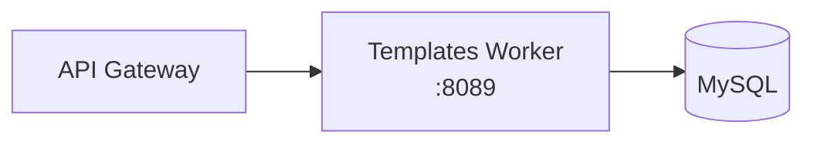

# Templates Worker

The templates worker provides email template management with Jinja2 rendering, version history, HTML + plaintext dual rendering, and usage analytics. It is a FastAPI service backed by MySQL, built and enabled in every deployment.

## Features

- **Template CRUD**: Create, read, update, delete email templates, scoped per organization
- **Jinja2 rendering**: `{{ first_name }}`-style variable substitution, rendered on demand via the render endpoint
- **Version history**: Every update records a version; history is queryable per template
- **Dual rendering**: HTML and plaintext bodies rendered together
- **Template library**: Pre-built templates for common use cases
- **Duplication**: Clone an existing template as a starting point
- **Usage stats**: Per-template render/usage statistics

## Architecture



## API Endpoints

Copied from the route decorators in `worker/templates/app.py`:

```
POST   /templates                        -- Create a template
GET    /templates?org_id=                -- List templates for an org
GET    /templates/library                -- Pre-built template library
GET    /templates/{template_id}          -- Get a template with content
PUT    /templates/{template_id}          -- Update a template (records a version)
DELETE /templates/{template_id}          -- Delete a template
POST   /templates/{template_id}/render   -- Render with supplied variables
POST   /templates/{template_id}/duplicate -- Duplicate a template
GET    /templates/{template_id}/versions -- Version history
GET    /templates/{template_id}/stats    -- Usage statistics
GET    /health                           -- Health check
GET    /metrics                          -- Prometheus metrics
```

## Configuration

| Variable | Default | Description |
|----------|---------|-------------|
| `PORT` | `8089` | Bind port |
| `DB_HOST` | `mysql` | MySQL host |
| `DB_PORT` | `3306` | MySQL port |
| `DB_NAME` | `mailserver` | Database name |
| `DB_USER` | `mailuser` | Database user |
| `DB_PASSWORD` | -- | Database password |

## Docker Configuration

```yaml
templates:
  build: ./worker/templates
  container_name: templates
  ports:
    - "8095:8089"
  volumes:
    - ./shared:/app/shared
```

The `./shared` mount is required: the `build: ./worker/templates` shorthand scopes the build context to that subdirectory, so the image never contains the repo-root `shared/` modules at build time. In production (`docker-compose.prod.yml`) the host port is bound to `127.0.0.1` only.
