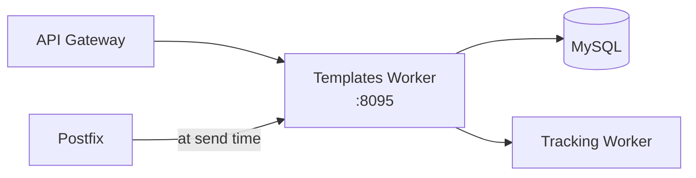

# Templates Worker

!!! warning "Under Construction"
    This worker is currently in development. The API and features described below represent the planned design and may change.

The templates worker provides dynamic email template management with variable substitution, version control, and A/B testing support.

## Planned Features

- **Template CRUD**: Create, read, update, delete email templates
- **Variable substitution**: `{{first_name}}`, `{{company}}`, etc., replaced at send time
- **Template versioning**: Track changes, rollback to previous versions
- **A/B testing**: Split recipients between template variants and track which performs better
- **Template library**: Pre-built templates for common use cases (welcome, password reset, notification)
- **Preview API**: Render a template with sample data without sending
- **Per-organization templates**: Multi-tenant template isolation

## Planned Architecture



## Planned API Endpoints

```
POST   /api/templates                   -- Create a template
GET    /api/templates                   -- List templates
GET    /api/templates/{id}              -- Get a template
PUT    /api/templates/{id}              -- Update a template
DELETE /api/templates/{id}              -- Delete a template
POST   /api/templates/{id}/render      -- Preview with sample data
POST   /api/templates/{id}/ab-test     -- Create an A/B test variant
GET    /api/templates/{id}/ab-results  -- Get A/B test results
```

## Configuration

| Variable | Default | Description |
|----------|---------|-------------|
| `DB_HOST` | `mysql` | MySQL host |
| `DB_NAME` | `mailserver` | Database name |

## Docker Configuration

```yaml
templates:
  build: ./worker/templates
  container_name: templates
  ports:
    - "8095:8089"
```
