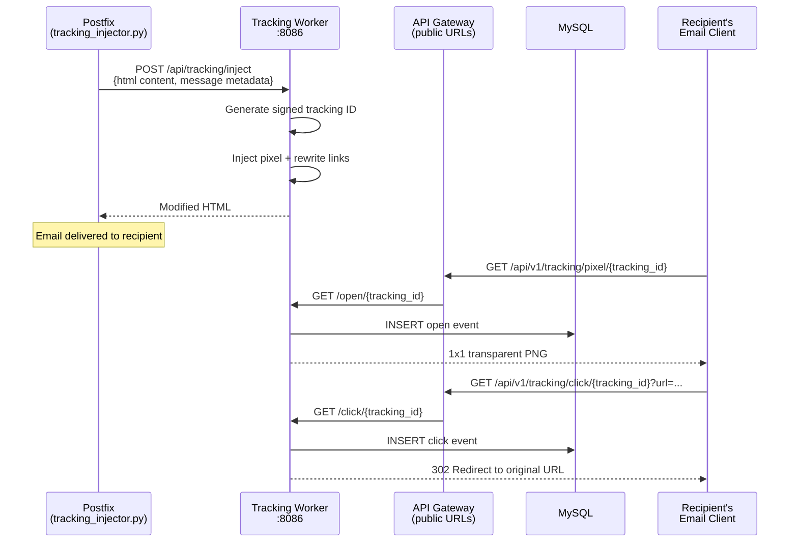

# Email Tracking Worker

The tracking worker handles open and click tracking for outgoing email. It is a FastAPI service that injects a 1x1 tracking pixel and rewrites links in outbound HTML, records open/click events in MySQL, manages the suppression list, and fires webhook events on engagement.

## What It Does

- **Injection API** -- the Postfix tracking injector POSTs outbound HTML here; the service returns it with a pixel injected and links rewritten
- **Open tracking** -- serves the pixel and records an `open` event
- **Click tracking** -- records a `click` event and 302-redirects to the original URL
- **Bounce and complaint ingestion** -- feeds the suppression list
- **Suppression list management** -- suppress/unsuppress addresses, one-click unsubscribe
- **Signed tracking IDs** -- HMAC-SHA256-signed tokens prevent forged events
- **Webhook events** -- `tracking.open`, `tracking.click`, `email.bounced`, `delivery.complaint` via `shared.webhook_dispatcher`

## How It Works



### Public URLs go through the API gateway

The pixel and click URLs embedded in mail must resolve on the public internet. They are built from `TRACKING_BASE_URL` plus `TRACKING_PIXEL_PATH` / `TRACKING_CLICK_PATH` (defaults `/api/v1/tracking/pixel` and `/api/v1/tracking/click`) -- i.e. they point at the **API gateway's** public hostname, and the gateway's `/api/v1/tracking/*` routes forward to this worker.

!!! warning "TRACKING_BASE_URL must resolve"
    The composed `{subdomain}.{domain}` fallback once produced `track.courier.mailyte.com`, which never existed in DNS -- every pixel and rewritten link was dead. The compose default is now `https://api.${DOMAIN}`, which resolves, sits behind Traefik with a valid certificate, and serves the pixel path. Keep it that way or point it at a name that actually resolves to the gateway.

## API Endpoints

Copied from the routers in `worker/tracking/api/` (mounted in `app.py`; `stats_api` carries an `/api` prefix):

```
# tracking_api (event recording)
GET  /open/{tracking_id}                    -- Record open, serve pixel
GET  /click/{tracking_id}?url=              -- Record click, redirect
POST /api/tracking/bounce                   -- Ingest a bounce notification
POST /api/tracking/complaint                -- Ingest an FBL complaint

# suppression_api
POST   /tracking/suppress                   -- Suppress an address
DELETE /tracking/suppress/{email}           -- Remove a suppression
GET    /tracking/unsubscribe/{tracking_id}  -- One-click unsubscribe page
POST   /tracking/unsubscribe/{tracking_id}  -- One-click unsubscribe (RFC 8058)

# stats_api (mounted under /api)
POST /api/tracking/inject                   -- Inject pixel + rewrite links (called by Postfix)
GET  /api/tracking/stats/{email_id}         -- Stats for one message
GET  /api/tracking/stats/domain/{domain}    -- Per-domain stats
GET  /api/tracking/stats/summary            -- Summary stats
GET  /api/tracking/tenant/{tenant_id}/stats -- Per-tenant stats
GET  /api/tracking/health                   -- Stats subsystem health

# health_api
GET /health            -- Health check
GET /health/detailed   -- Detailed health
GET /ready             -- Readiness probe
GET /live              -- Liveness probe

# app.py
GET /metrics           -- Prometheus metrics
```

Tenant-facing access (pixel, click, unsubscribe, suppression management, stats) is proxied by the API gateway under `/api/v1/tracking/*` (`worker/api/routes/tracking.py`), with organization scoping enforced there -- wired up and working since 2026-08-08.

## Tracking ID Structure

Tracking IDs are not JWTs. Each ID is the URL-safe base64 encoding of:

```
{email_id}:{recipient}:{tenant_id}:{domain_id}:{timestamp}:{nonce}:{signature}
```

where `signature` is the first 16 hex chars of an HMAC-SHA256 over the preceding fields, keyed with `WEBHOOK_SECRET`. `decode_tracking_id()` verifies the signature with a constant-time compare before any event is recorded, so events cannot be forged by guessing URLs.

## Data Stores

| Table | Purpose |
|-------|---------|
| `email_tracking` (MySQL) | Individual open/click events with IP and user agent |
| `email_suppressions` (MySQL) | Suppression list (bounces, complaints, unsubscribes) |
| Redis | Config and rate-limit caching |

## Configuration

| Variable | Default | Description |
|----------|---------|-------------|
| `TRACKING_BASE_URL` | `https://api.${DOMAIN}` (compose) | Public base for pixel/click URLs -- must resolve to the API gateway |
| `TRACKING_PIXEL_PATH` | `/api/v1/tracking/pixel` | Pixel path on the gateway |
| `TRACKING_CLICK_PATH` | `/api/v1/tracking/click` | Click path on the gateway |
| `TRACKING_DOMAIN` / `TRACKING_SUBDOMAIN` / `TRACKING_PROTOCOL` | `$HOSTNAME` / `track` / `https` | Fallback URL composition when `TRACKING_BASE_URL` is unset |
| `WEBHOOK_SECRET` | -- | HMAC key for tracking ID signatures and webhook signing |
| `WEBHOOK_URL` | -- | Read by `shared.webhook_dispatcher` (mapped from `WEBHOOK_URLS` in compose -- the dispatcher reads the singular name) |
| `DB_HOST` / `DB_PORT` / `DB_NAME` / `DB_USER` / `DB_PASSWORD` | `mysql` / `3306` / `mailserver` / -- / -- | MySQL connection |
| `REDIS_HOST` / `REDIS_PORT` | `redis` / `6379` | Redis connection |
| `TRACKING_ORGANIZATION_CONFIGS` | (empty) | Per-org tracking config overrides (JSON) |

## Docker Configuration

```yaml
tracking:
  build:
    context: .
    dockerfile: ./worker/tracking/Dockerfile
  container_name: tracking
  ports:
    - "8086:8086"
  extra_hosts:
    - "host.docker.internal:host-gateway"
```

In production (`docker-compose.prod.yml`) the service runs with **`replicas: 2`** -- `container_name` and the host port mapping are reset there, since fixed names and host ports cannot be shared between replicas; Traefik and the other services reach it by service name.

## Connections to Other Services

- **Postfix** calls `/api/tracking/inject` from `mailer/postfix/scripts/tracking_injector.py`, which runs as the `tracking-filter` content filter on the submission (587), smtps (465), and internal 10587 listeners
- **Webhook events** are dispatched directly via `shared.webhook_dispatcher` (HTTP POST to `WEBHOOK_URL`), not via Redis pub/sub
- **Analytics worker** reads `email_tracking` for engagement reporting
- **API gateway** fronts all public and tenant-facing routes

## Gotchas

!!! warning "Image blocking"
    Many email clients block images by default, so open pixels never load. Open rates will always undercount. Industry-wide limitation, not a bug.

!!! warning "Link rewriting and spam scores"
    Rewriting links through a tracking host can hurt spam scoring if that host's reputation is poor. The tracking host is the API gateway's hostname -- keep its DNS and TLS in order.
