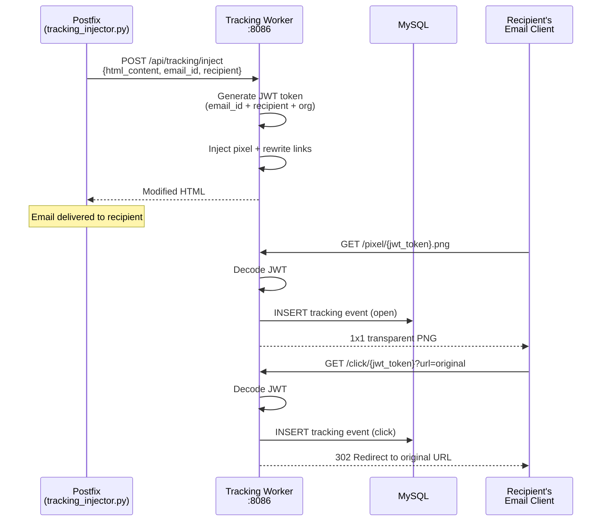

# Email Tracking Worker

The tracking worker handles open and click tracking for outgoing emails. It serves 1x1 transparent PNG tracking pixels, processes click redirects, stores tracking events in MySQL, and generates JWT tokens that encode message/recipient information.

## What It Does

- Serves **tracking pixels** (1x1 PNG) that fire when an email is opened
- Handles **click redirects** -- rewritten links route through this service before going to the real destination
- Stores all tracking events in MySQL with timestamps, IP addresses, and user agents
- Uses **JWT tokens** to encode message ID, recipient, organization, and domain info
- Provides an injection API that the Postfix tracking injector calls to modify HTML content
- Multi-tenant support with per-organization tracking data isolation
- Rate limiting to prevent abuse

## How It Works



## API Endpoints

### Tracking Injection (called by Postfix)

```
POST /api/tracking/inject
```

Request:
```json
{
  "html_content": "<html>...",
  "email_id": "abc123@mail.example.com",
  "recipient": "user@example.com",
  "tenant_id": "org-uuid",
  "domain_id": "domain-uuid",
  "enable_open_tracking": true,
  "enable_click_tracking": true
}
```

Response:
```json
{
  "success": true,
  "modified_content": "<html>...with pixel and rewritten links...",
  "tracking_id": "trk-uuid",
  "tracking_injected": {
    "open_tracking": true,
    "click_tracking": true,
    "links_rewritten": 5
  }
}
```

### Tracking Pixel (loaded by email client)

```
GET /pixel/{jwt_token}.png
```

Returns a 1x1 transparent PNG. Records an "open" event.

### Click Redirect (user clicks a link)

```
GET /click/{jwt_token}?url={base64_encoded_original_url}
```

Records a "click" event and 302-redirects to the original URL.

### Stats API

```
GET /api/stats/overview     -- global tracking stats
GET /api/stats/{email_id}   -- tracking stats for a specific email
```

### Health

```
GET /health    -- service health check
GET /metrics   -- Prometheus metrics
```

## JWT Token Structure

Each tracking URL encodes a JWT token with:

```json
{
  "eid": "message-id",
  "rid": "recipient@example.com",
  "oid": "organization-id",
  "did": "domain-id",
  "ts": 1700000000,
  "typ": "open"
}
```

Tokens are signed with HMAC-SHA256 using the `TRACKING_SECRET` environment variable. This prevents tampering -- you cannot fake tracking events by guessing URLs.

## Database Tables

| Table | Purpose |
|-------|---------|
| `email_tracking` | Individual tracking events (opens, clicks) |
| `tracking_links` | Rewritten links with original URLs |
| `tracking_stats` | Aggregated stats per email/domain/org |

### email_tracking schema

| Column | Type | Description |
|--------|------|-------------|
| `id` | INT | Primary key |
| `email_id` | VARCHAR | Message ID |
| `recipient` | VARCHAR | Recipient email |
| `event_type` | ENUM | `open`, `click` |
| `ip_address` | VARCHAR | Client IP |
| `user_agent` | TEXT | Client user agent |
| `url` | TEXT | Clicked URL (for click events) |
| `organization_id` | VARCHAR | Org for data isolation |
| `domain_id` | VARCHAR | Domain |
| `created_at` | DATETIME | Event timestamp |

## Configuration

| Variable | Default | Description |
|----------|---------|-------------|
| `TRACKING_SECRET` | (required) | HMAC secret for JWT signing |
| `TRACKING_BASE_URL` | `http://tracking:8086` | Base URL for tracking pixel/click URLs |
| `DB_HOST` | `mysql` | MySQL host |
| `DB_NAME` | `mailserver` | Database name |
| `REDIS_HOST` | `redis` | Redis host (for rate limiting) |
| `WEBHOOK_SERVICE_URL` | `http://webhooks:8081` | Webhook service for event dispatch |

## Docker Configuration

```yaml
tracking:
  build: ./worker/tracking
  container_name: tracking
  ports:
    - "8086:8086"
  depends_on:
    - mysql
    - redis
```

## Connections to Other Services

- **Postfix** calls the injection API via the `tracking_injector.py` content filter
- **Webhooks worker** receives tracking events (email.opened, email.clicked) via Redis pub/sub
- **Analytics worker** aggregates tracking data for reporting
- **API gateway** proxies tracking stats to the admin dashboard

## Gotchas

!!! warning "Image Blocking"
    Many email clients block images by default, which means open tracking pixels never load. Open rates will always be lower than actual opens. This is an industry-wide limitation, not a bug.

!!! warning "Link Rewriting and Spam Scores"
    Rewriting all links through a tracking domain can trigger spam filters if the tracking domain has poor reputation. Make sure your tracking domain has proper DNS records (SPF, DKIM, DMARC) and is not on any blocklists.

!!! tip "Testing"
    To test tracking without sending real email, call the injection API directly and then load the pixel URL in your browser. You should see the event appear in the `email_tracking` table.
