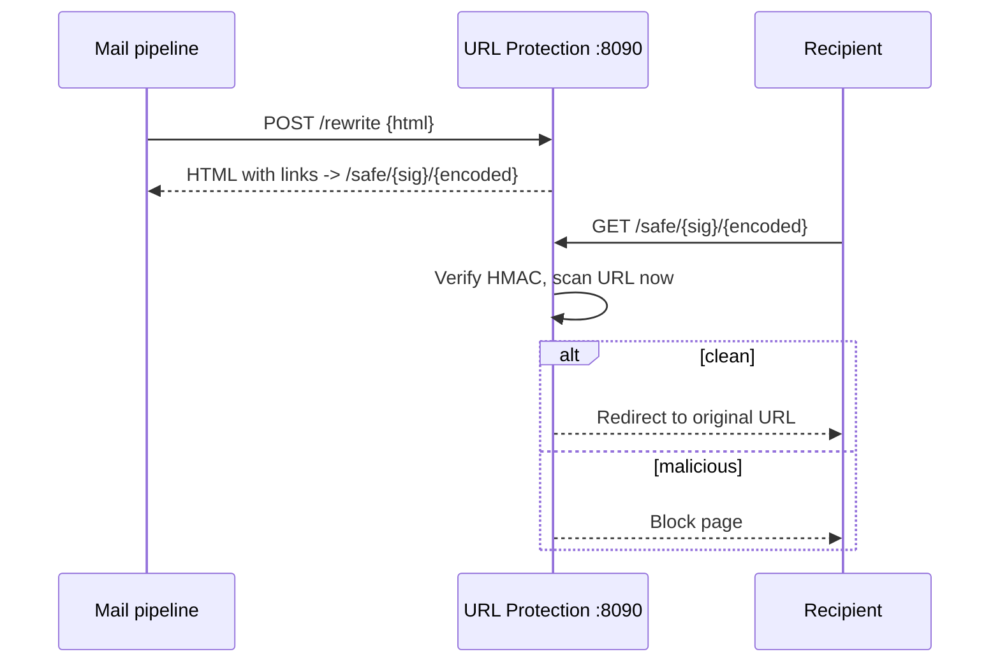

# URL Protection Worker

The URL protection worker provides Microsoft Defender-style **Safe Links** for email: URL rewriting through a verification proxy, time-of-click scanning, reputation tracking, click analytics, and a blocklist. It is a FastAPI service backed by MySQL and Redis.

## What It Does

- **URL rewriting**: `/rewrite` takes email HTML and rewrites links to route through `/safe/{sig}/{encoded}` on `SAFE_LINK_BASE_URL`
- **Time-of-click verification**: when a recipient clicks, the link is checked *then* -- a URL that turned malicious after delivery is still caught
- **HMAC-signed links**: the `{sig}` component is keyed with `URL_HMAC_SECRET`, so safe links cannot be forged or tampered with
- **URL scanning**: blocklist plus heuristic phishing detection
- **Reputation tracking** per destination domain, cached in Redis
- **Click analytics** per organization

## How It Works



## API Endpoints

Copied from the route decorators in `worker/url_protection/app.py`:

```
POST   /rewrite                 -- Rewrite URLs in email HTML
GET    /safe/{sig}/{encoded}    -- Safe-link redirect (time-of-click check)
POST   /scan                    -- Scan a single URL for threats
GET    /clicks?org_id=          -- Click analytics
GET    /reputation/{domain}     -- Domain reputation
POST   /blocklist               -- Add a URL/domain to the blocklist
DELETE /blocklist/{entry_id}    -- Remove a blocklist entry
GET    /blocklist?org_id=       -- List blocklist entries
GET    /health                  -- Health check
GET    /metrics                 -- Prometheus metrics
```

## Configuration

| Variable | Default | Description |
|----------|---------|-------------|
| `PORT` | `8090` | Bind port |
| `SAFE_LINK_BASE_URL` | `https://safe.mailyte.com` | Public base for rewritten links -- must resolve and route to this service |
| `URL_HMAC_SECRET` | `change-me-in-production` (in-code fallback) | HMAC key for link signatures. The `secrets-check` compose service fails the whole stack's startup when this is missing from `.env` |
| `DB_HOST` / `DB_PORT` / `DB_NAME` / `DB_USER` / `DB_PASSWORD` | `mysql` / `3306` / `mailserver` / -- / -- | MySQL connection |
| `REDIS_HOST` / `REDIS_PORT` | `redis` / `6379` | Reputation/result caching |

## Docker Configuration

```yaml
url_protection:
  build: ./worker/url_protection
  container_name: url_protection
  ports:
    - "8096:8090"     # host 8096 -> container 8090
  volumes:
    - ./shared:/app/shared     # build context excludes repo-root shared/
  depends_on:
    - mysql
    - migrate
    - redis
```

In production (`docker-compose.prod.yml`) the host port is bound to `127.0.0.1` only.

## Gotchas

!!! warning "SAFE_LINK_BASE_URL must be publicly routed"
    Rewritten links are only as good as the host they point at. There is no Traefik router for a `safe.*` hostname in `docker-compose.prod.yml` as of 2026-08-30 -- until one exists (or `SAFE_LINK_BASE_URL` is pointed at a routed hostname), rewritten links will not resolve for recipients.
