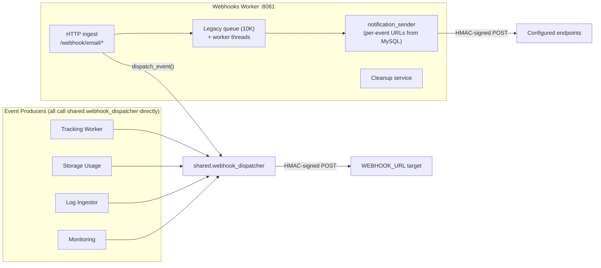

# Webhooks Worker

The webhooks worker is the event-ingest and notification service for mail-flow events. It is a FastAPI service that receives raw email events over HTTP (inbound/outbound SMTP, IMAP, POP3), extracts metadata, and dispatches signed webhook notifications to external URLs. It also runs the webhook delivery-log cleanup service.

Event delivery across the platform is built on `shared/webhook_dispatcher.py`, which every service imports directly -- there is no Redis pub/sub fanout. This worker is one producer among several (tracking, storage_usage, log_ingestor, monitoring, and others all call `dispatch_event()` themselves); what is unique to this worker is the email-event HTTP ingest and the cleanup APIs.

## What It Does

- Receives raw email events on `/webhook/email/{inbound,outbound,imap,pop3}` (multipart or JSON with the raw `.eml`), parses metadata and attachments
- Dispatches `email.inbound` / `email.outbound` / IMAP / POP3 events through `shared.webhook_dispatcher` with HMAC signing
- Maintains a legacy in-process queue (10,000 max) drained by worker threads, whose `notification_sender` fans out to per-event-type URLs configured in the `webhook_urls` MySQL table plus `WEBHOOK_URLS` / `EMAIL_WEBHOOK_URLS` / `RATE_LIMIT_WEBHOOK_URLS` env vars
- Cleans up old delivery logs on a schedule (`WEBHOOK_CLEANUP_*` settings)
- Prometheus metrics at `/metrics`

## How It Works



## Event Types

The canonical catalog is the `Events` class in `shared/webhook_dispatcher.py` -- roughly 80 event names across these families:

| Family | Examples |
|--------|----------|
| `email.*` | `email.accepted`, `email.inbound`, `email.outbound`, `email.delivered`, `email.bounced`, `email.deferred`, `email.rejected`, `email.read`, `email.moved`, `email.flagged`, ... |
| `tracking.*` | `tracking.open`, `tracking.click`, `tracking.unsubscribe` |
| `delivery.*` | `delivery.success`, `delivery.bounce.hard`, `delivery.bounce.soft`, `delivery.complaint`, `delivery.delayed` |
| `auth.*` | `auth.login.success`, `auth.login.failure`, `auth.password.changed`, `auth.api_key.created`, ... |
| `rate_limit.*` | `rate_limit.threshold_breach`, `rate_limit.exceeded`, `rate_limit.reset` |
| `storage.*` | `storage.quota.warning`, `storage.quota.exceeded`, `storage.usage.report` |
| `queue.*` | `queue.flushed`, `queue.held`, `queue.released`, ... |
| `health.*` | `health.service.down`, `health.service.up`, `health.system.alert` |
| `security.*` | `security.brute_force`, `security.dlp.violation`, `security.spam.detected`, ... |
| `migration.*` | `migration.started`, `migration.progress`, `migration.completed`, `migration.failed` |

## Payload Signing

`shared.webhook_dispatcher` signs every delivery twice:

1. **Header**: `X-Webhook-Signature: sha256=<hex>` -- HMAC-SHA256 of the full JSON body, keyed with `WEBHOOK_SECRET`. Accompanied by `X-Webhook-Id`, `X-Webhook-Event`, `X-Webhook-Source`, and `X-Webhook-Timestamp`.
2. **Inline block** for replay protection: `payload["signature"] = {"timestamp": <unix>, "token": "<hex nonce>", "signature": "<hmac>"}` where `signature = hmac(secret, str(timestamp) + token)`.

Failed deliveries are recorded -- the dispatcher writes `webhook_delivery_logs` and, on exhausted retries, `webhook_dead_letters`.

## API Endpoints

Copied from the route decorators in `worker/webhooks/app.py`:

```
POST /webhook/email/inbound    -- Ingest a raw inbound email event
POST /webhook/email/outbound   -- Ingest a raw outbound email event
POST /webhook/email/imap       -- Ingest an IMAP activity event
POST /webhook/email/pop3       -- Ingest a POP3 activity event
GET  /webhook/status           -- Queue size, worker stats
POST /webhook/test             -- Fire a test event through the dispatcher
GET  /cleanup/stats            -- Delivery-log cleanup statistics
POST /cleanup/now              -- Run cleanup immediately
GET  /cleanup/config           -- Current cleanup configuration
PUT  /cleanup/config           -- Update cleanup configuration
GET  /health                   -- Health check
GET  /metrics                  -- Prometheus metrics
```

`worker/webhooks/health_monitor.py` contains an additional Flask-style app (`/webhook-health/*`) that is not started by `app.py` -- legacy code, not part of the running service.

## Configuration

| Variable | Default | Description |
|----------|---------|-------------|
| `WEBHOOK_URL` | (empty) | The single global target `shared.webhook_dispatcher` posts to. Compose maps `WEBHOOK_URLS` into it -- **the dispatcher reads the singular name**; without the mapping every `dispatch_event()` silently no-ops |
| `WEBHOOK_URLS` | -- | Read by this service's own `notification_sender` (comma-separated) |
| `EMAIL_WEBHOOK_URLS` / `RATE_LIMIT_WEBHOOK_URLS` | (empty) | Per-family URL lists for the legacy sender |
| `WEBHOOK_SECRET` | (required) | HMAC signing key |
| `WEBHOOK_WORKERS` | `5` | Legacy queue worker threads |
| `WEBHOOK_MAX_RETRIES` / `WEBHOOK_RETRY_DELAY` / `WEBHOOK_TIMEOUT` | `3` / `5` / `30` | Legacy sender retry behavior |
| `WEBHOOK_CLEANUP_ENABLED` / `WEBHOOK_CLEANUP_SCHEDULE_HOURS` / `WEBHOOK_SUCCESSFUL_RETENTION_HOURS` / `WEBHOOK_FAILED_RETENTION_HOURS` | -- | Delivery-log cleanup |
| `DB_HOST` / `DB_PORT` / `DB_NAME` / `DB_USER` / `DB_PASSWORD` | `mysql` / `3306` / `mailserver` / -- / -- | MySQL connection |
| `REDIS_HOST` / `REDIS_PORT` | `redis` / `6379` | Redis connection |

## Database Tables

| Table | Purpose |
|-------|---------|
| `webhook_urls` | Per-event-type endpoint config (URL, secret, headers, retries, auth) used by the legacy sender |
| `webhook_delivery_logs` | Delivery attempts (written by `shared.webhook_dispatcher`) |
| `webhook_dead_letters` | Deliveries that exhausted retries |

## Docker Configuration

```yaml
webhooks:
  build: ./worker/webhooks
  container_name: webhooks
  ports:
    - "8081:8081"
  extra_hosts:
    - "host.docker.internal:host-gateway"
  depends_on:
    - mysql
    - migrate
    - redis
```

In production (`docker-compose.prod.yml`) the service runs with **`replicas: 2`** -- `container_name` and the host port mapping are reset there, since fixed names and host ports cannot be shared between replicas.

## Gotchas

!!! warning "WEBHOOK_URL vs WEBHOOK_URLS"
    `shared/webhook_dispatcher.py` reads `WEBHOOK_URL` (singular). The `.env` key is `WEBHOOK_URLS` (plural), read by this service's own sender. Compose maps one to the other on every producing service -- if you add a new producer, wire both or `dispatch_event()` will silently do nothing.

!!! warning "Queue overflow"
    The legacy in-memory queue maxes out at 10,000 events; when full, new events to it are dropped. Monitor `/webhook/status`.

!!! tip "Debugging"
    Check `webhook_delivery_logs` for delivery attempts and status codes, and `webhook_dead_letters` for events that exhausted retries.
