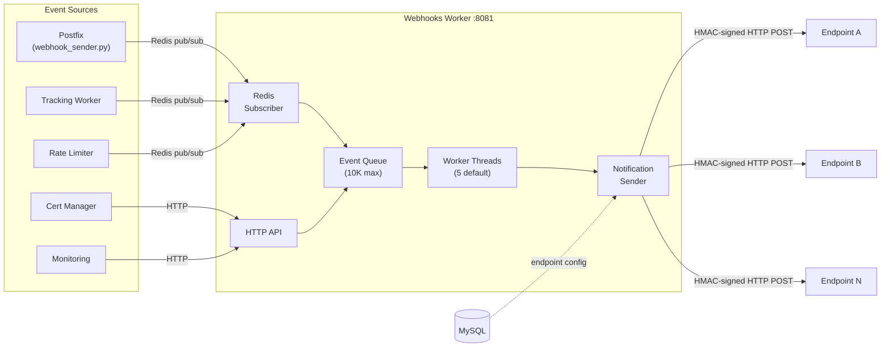

# Webhooks Worker

The webhooks worker is the event notification system for Mailyte. Whenever something interesting happens (email sent, delivered, bounced, opened, clicked, rate limit hit, cert renewed, etc.), this service dispatches the event to all registered webhook endpoints. Think of it as a pub/sub fanout that bridges the internal mail system to the outside world.

## What It Does

- Receives events from all services via **Redis pub/sub** and a direct HTTP API
- Dispatches events to registered webhook URLs with **HMAC signing**
- **Retry with exponential backoff** for failed deliveries
- Queues events in-memory (up to 10,000) to absorb traffic spikes
- Processes events with a pool of worker threads (configurable)
- Tracks delivery metrics and exposes Prometheus endpoints

## How It Works



## Event Types

| Event | Trigger |
|-------|---------|
| `email.sent` | Email accepted by Postfix for delivery |
| `email.delivered` | Email delivered to remote server |
| `email.bounced` | Email bounced (hard or soft) |
| `email.deferred` | Email temporarily deferred |
| `email.opened` | Tracking pixel loaded |
| `email.clicked` | Tracking link clicked |
| `email.inbound` | Inbound email received |
| `email.outbound` | Outbound email processed |
| `rate_limit.exceeded` | Rate limit hit for org/domain/mailbox |
| `quota.warning` | Mailbox approaching storage quota |
| `cert.issued` | New SSL certificate issued |
| `cert.renewed` | SSL certificate renewed |
| `cert.failed` | SSL certificate renewal failed |
| `security.ban` | Fail2ban banned an IP |
| `security.unban` | Fail2ban unbanned an IP |
| `service.down` | Monitored service went down |
| `service.recovered` | Monitored service recovered |

## Webhook Payload Format

Every webhook delivery includes:

```json
{
  "event": "email.delivered",
  "timestamp": "2025-01-15T10:30:00Z",
  "data": {
    "message_id": "abc123@mail.example.com",
    "from": "sender@example.com",
    "to": "recipient@example.com",
    "subject": "Hello World",
    "domain": "example.com",
    "organization_id": "org-uuid"
  }
}
```

### HMAC Signing

Every payload is signed with HMAC-SHA256. The signature is in the `X-Webhook-Signature` header:

```
X-Webhook-Signature: sha256=a1b2c3d4e5f6...
X-Webhook-Timestamp: 1700000000
X-Webhook-Source: mailyte-enterprise
```

To verify on the receiving end:

```python
import hmac, hashlib

expected = hmac.new(webhook_secret.encode(), payload_json.encode(), hashlib.sha256).hexdigest()

assert request.headers["X-Webhook-Signature"] == f"sha256={expected}"
```

## Retry Logic

Failed deliveries are retried with exponential backoff:

| Attempt | Delay |
|---------|-------|
| 1st retry | 30 seconds |
| 2nd retry | 2 minutes |
| 3rd retry | 10 minutes |
| 4th retry | 1 hour |
| 5th retry | 6 hours |

After 5 failed attempts, the event is dropped and a warning is logged. The endpoint's failure count is tracked; after enough consecutive failures, the endpoint can be auto-disabled.

## API Endpoints

```
POST /webhook/event     -- Submit an event for dispatch
GET  /webhook/status    -- Queue size, worker stats, delivery metrics
GET  /health            -- Health check
GET  /metrics           -- Prometheus metrics
```

## Configuration

| Variable | Default | Description |
|----------|---------|-------------|
| `WEBHOOK_WORKERS` | `5` | Number of worker threads |
| `WEBHOOK_SECRET` | (required) | HMAC secret for signing payloads |
| `WEBHOOK_MAX_BODY_SIZE` | `1048576` | Max payload size in bytes (1 MB) |
| `WEBHOOK_TIMEOUT` | `30` | HTTP timeout for delivery attempts (seconds) |
| `REDIS_HOST` | `redis` | Redis host for pub/sub |
| `DB_HOST` | `mysql` | MySQL host for endpoint config |

## Database Tables

| Table | Purpose |
|-------|---------|
| `webhook_endpoints` | Registered URLs, secrets, event filters |
| `webhook_deliveries` | Delivery log with status and retry count |
| `webhook_events` | Event history |

## Docker Configuration

```yaml
webhooks:
  build: ./worker/webhooks
  container_name: webhooks
  ports:
    - "8081:8081"
  depends_on:
    - mysql
    - redis
```

## Gotchas

!!! warning "Queue Overflow"
    The in-memory queue maxes out at 10,000 events. If the queue fills up (e.g., all webhook endpoints are down), new events are dropped. Monitor the queue size via the `/webhook/status` endpoint.

!!! warning "Endpoint Timeouts"
    If your webhook receiver is slow (> 30s), the delivery will time out and trigger a retry. Make sure your endpoint responds quickly -- ideally just acknowledge receipt and process async.

!!! tip "Debugging"
    Check the `webhook_deliveries` table to see delivery attempts, HTTP status codes, and error messages for each event.
